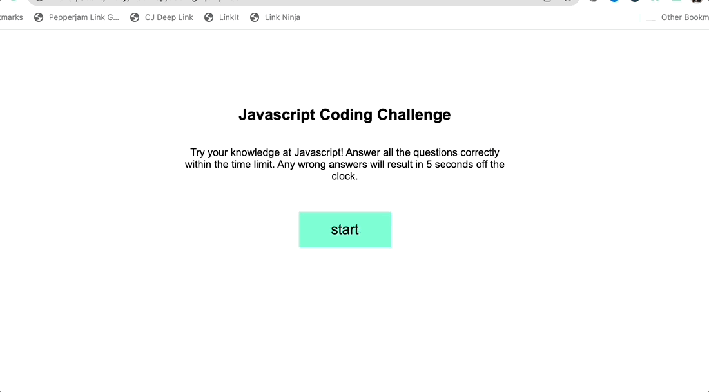

# coding-quiz

## Description

This code creates a simple Javascript quiz. It can be configured with as many or few questions desired with ability to choose question and answers choices. 

It presents the user with an intro page and start button. Once the start button is clicked, a timer starts and the first question appears. The answers are presented as buttons and when an answer is clicked the next question appears while the current one disappears. If the question is incorrect, five seconds are docked from the time.

After all questions are answered, the timer stops and the score is recored as the amount of time left on the timer. If the timer hits zero before all questions are answered, the quiz will automatically end. 

https://mardill.github.io/coding-quiz/

## Installation

This code can be used with access to html, css, and Javascript that can be run in a browser.

## Usage

The user is able to create as many questions as they'd like with the ability to choose all the text associated with the question.

The time is configurable as well as the number of seconds subtracted from the timer when an answer is wrong. 

When a user starts the quiz, they will then see each question one after the other when an answer button is chosen. The quiz will end when the timer hits zero or the user answers all the question. The score is logged as total seconds left. 

## License

MIT License

Copyright (c) 2022 mardill

Permission is hereby granted, free of charge, to any person obtaining a copy
of this software and associated documentation files (the "Software"), to deal
in the Software without restriction, including without limitation the rights
to use, copy, modify, merge, publish, distribute, sublicense, and/or sell
copies of the Software, and to permit persons to whom the Software is
furnished to do so, subject to the following conditions:

The above copyright notice and this permission notice shall be included in all
copies or substantial portions of the Software.

THE SOFTWARE IS PROVIDED "AS IS", WITHOUT WARRANTY OF ANY KIND, EXPRESS OR
IMPLIED, INCLUDING BUT NOT LIMITED TO THE WARRANTIES OF MERCHANTABILITY,
FITNESS FOR A PARTICULAR PURPOSE AND NONINFRINGEMENT. IN NO EVENT SHALL THE
AUTHORS OR COPYRIGHT HOLDERS BE LIABLE FOR ANY CLAIM, DAMAGES OR OTHER
LIABILITY, WHETHER IN AN ACTION OF CONTRACT, TORT OR OTHERWISE, ARISING FROM,
OUT OF OR IN CONNECTION WITH THE SOFTWARE OR THE USE OR OTHER DEALINGS IN THE
SOFTWARE.
